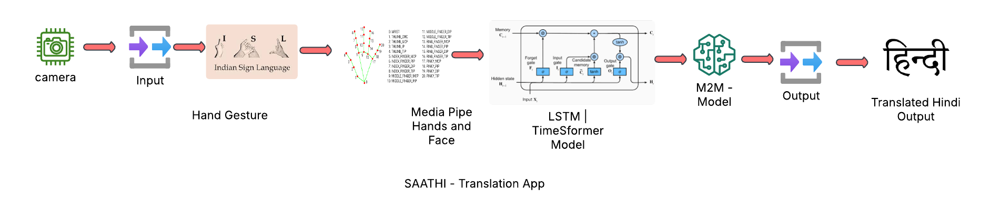

# Saathi: Bridging the Communication Gap for the Deaf and Mute Community
Communication is a fundamental human right, yet millions of deaf and mute individuals in India face barriers in expressing themselves. **Saathi**, an innovative web application, aims to break these barriers by enabling real-time translation of **Indian Sign Language (ISL) into Hindi text and speech.**

Powered by **advanced deep learning models, computer vision, and natural language processing**, Saathi seamlessly recognizes sign gestures from video input, converts them into meaningful Hindi text, and further transforms them into speech. This empowers individuals with hearing and speech impairments to communicate effortlessly with those unfamiliar with sign language.

With Saathi, we envision an **inclusive and accessible** world where technology fosters meaningful conversations, enhances social interactions, and bridges the communication gap for the deaf and mute community of India.

#### [Watch Demo Video](SAATHI_APP_FOR_INDIAN_COMMUNITY.mp4)

------------------------------------------------------------------------------------------------------------------------------------------------------------------------------------------------------------------
### Tech Stack

**Frontend** - Streamlit

**Backend** - Flask , OpenCV , MediaPipe , Transformers

**Deep Learning** - PyTorch 

PHASE 1 - **LSTM**

PHASE 2 - **TimeSformer**

**Database (Future Enhancements)** - MongoDB

**Deployment** - AWS, Docker , Netlify

-----------------------------------------------------
#### Flow Diagram

